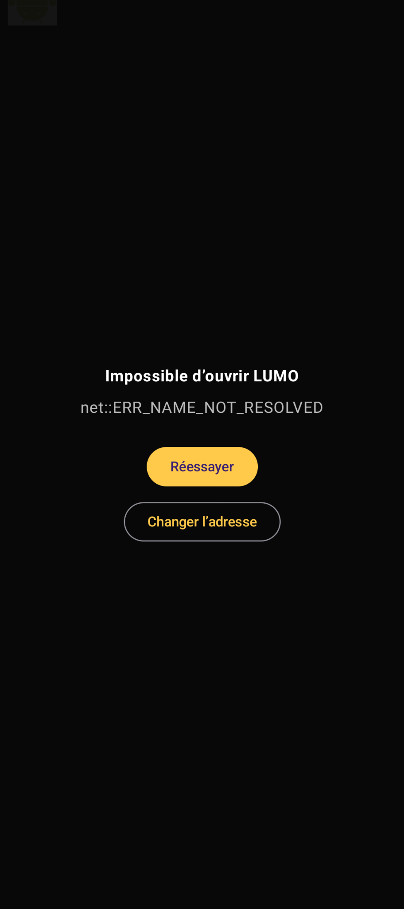
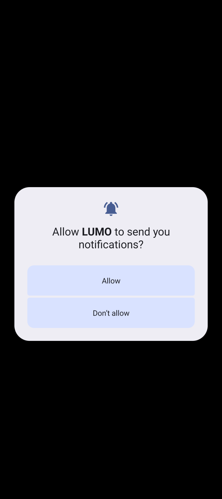

<div align="center">
  

# LUMO

**L'interface LUMO / Jellyfin dans une application Android dédiée.**

WebView intégrée · Session persistante · Lecture vidéo · Contrôles multimédia Android · Picture-in-Picture

[](https://github.com/0x80070006/LUMO/releases/download/lumo_v1.2/LUMO-1.2.apk)
[](https://github.com/0x80070006/LUMO/releases/tag/lumo_v1.2)

</div>

> [!WARNING]
> **LUMO est un client Android pour votre propre interface LUMO / Jellyfin.** L'application ne fournit ni serveur Jellyfin ni catalogue de contenus. L'adresse configurée doit être accessible depuis le téléphone. Si votre serveur est privé via **Tailscale**, connectez d'abord le téléphone au Tailnet. Pour l'installation de l'APK hors Play Store, Android peut également demander d'autoriser temporairement l'installation depuis la source utilisée.

---

## 📦 Télécharger LUMO

### Dernière version : **LUMO 1.2**

<p align="center">

[](https://github.com/0x80070006/LUMO/releases/download/lumo_v1.2/LUMO-1.2.apk)
[](https://github.com/0x80070006/LUMO/releases/tag/lumo_v1.2)

</p>

L'APK Android est disponible dans les **Assets** de la release GitHub.

---

## ✨ LUMO en bref

LUMO transforme votre interface web LUMO / Jellyfin en une expérience Android dédiée. L'application embarque l'interface dans une **WebView**, mémorise l'adresse du serveur, conserve la session de connexion et ajoute des fonctions natives autour de la lecture multimédia.

| Fonction | Ce que LUMO apporte |
| --- | --- |
| 🌐 **Interface intégrée** | LUMO / Jellyfin s'ouvre directement dans l'application |
| 🔐 **Session persistante** | Adresse du serveur, cookies et session conservés |
| 🎬 **Lecture vidéo** | Compatibilité renforcée avec le lecteur et les iframes Jellyfin |
| 🔔 **Contrôles Android** | Lecture/pause, précédent, suivant, progression et informations du média |
| 🖼️ **Picture-in-Picture** | La vidéo peut rester visible au-dessus des autres applications |
| 🔒 **Gestion de la veille** | Mise en pause lors du verrouillage de l'écran |
| 🔄 **Récupération réseau** | Réessayer ou changer l'adresse si le serveur ne répond plus |
| 🛡️ **Usage privé** | Compatible avec un serveur accessible via Tailscale |

---

## 📱 Aperçu de l'application

### Interface LUMO

<p align="center">
  
</p>

### Configuration, récupération et autorisations

<table>
  <tr>
    <td align="center"><br><sub><b>Configuration du serveur</b></sub></td>
    <td align="center"><br><sub><b>Récupération après erreur</b></sub></td>
    <td align="center"><br><sub><b>Autorisation des notifications</b></sub></td>
  </tr>
</table>

### Expérience multimédia Android

<table>
  <tr>
    <td align="center"><br><sub><b>Contrôles multimédia système</b></sub></td>
    <td align="center"><br><sub><b>Picture-in-Picture</b></sub></td>
  </tr>
</table>

---

## ⚙️ Premier lancement

Au premier démarrage, LUMO affiche un écran de configuration. Entrez simplement l'adresse complète de votre interface web :

```text
https://votre-serveur.example.com/
```

Puis appuyez sur **Ouvrir LUMO**.

Une fois l'adresse enregistrée :

```text
Lancement de l'application
        ↓
Adresse déjà enregistrée
        ↓
Chargement de LUMO
        ↓
Session existante restaurée
```

Vous n'avez donc pas besoin de saisir l'adresse à chaque démarrage.

---

## 🌐 Interface LUMO intégrée

L'application affiche directement l'interface web LUMO dans une WebView Android. Elle prend notamment en charge :

- l'authentification LUMO / Jellyfin ;
- les cookies et la session persistante ;
- JavaScript ;
- la lecture vidéo ;
- la navigation dans les films et séries ;
- le bouton **Retour** d'Android ;
- le stockage local de l'adresse du serveur ;
- la récupération après une erreur de connexion.

---

## 🎬 Lecture vidéo

**LUMO 1.2** améliore la compatibilité avec le lecteur vidéo utilisé par l'interface LUMO et Jellyfin.

L'application peut détecter le lecteur multimédia même lorsqu'il est chargé dans une **iframe Jellyfin**. Lorsqu'une lecture reste bloquée dans l'interface intégrée, LUMO peut basculer vers le lecteur Jellyfin afin de permettre le démarrage du film ou de l'épisode.

---

## 🔔 Contrôles multimédia Android

Pendant la lecture, LUMO utilise les fonctions multimédia natives d'Android. Les contrôles système peuvent afficher :

- le titre du film ou de l'épisode ;
- la jaquette du média ;
- précédent ;
- lecture / pause ;
- suivant ;
- la progression de la lecture ;
- les informations de la lecture en cours.

Les commandes restent ainsi accessibles depuis Android sans devoir revenir immédiatement dans l'application.

> [!IMPORTANT]
> Sur les versions modernes d'Android, autorisez les **notifications** si vous souhaitez profiter pleinement des contrôles multimédia système. Sans cette autorisation, la lecture vidéo reste possible, mais certains contrôles peuvent ne pas être affichés.

---

## 🖼️ Picture-in-Picture

LUMO prend en charge le mode **Picture-in-Picture** d'Android. Lorsque vous revenez à l'écran d'accueil pendant une lecture, la vidéo peut continuer dans une petite fenêtre flottante au-dessus des autres applications.

Cela permet par exemple d'ouvrir une autre application, répondre à un message ou consulter une page web tout en gardant la vidéo visible. Lorsque la fenêtre Picture-in-Picture est fermée, LUMO arrête ou met en pause la lecture.

---

## 🔒 Mise en veille et plein écran

Lorsque le téléphone est verrouillé pendant la lecture :

```text
Lecture vidéo
      ↓
Écran verrouillé
      ↓
Vidéo mise en pause
      ↓
Contrôles multimédia toujours disponibles
```

LUMO utilise également un mode immersif afin de laisser le maximum d'espace à l'interface et à la vidéo. La barre de statut Android peut être masquée pendant l'utilisation.

---

## 🔄 Changer l'adresse du serveur

Si le serveur est inaccessible, LUMO affiche un écran de récupération avec deux possibilités :

- **Réessayer** : tente de recharger le serveur actuellement enregistré ;
- **Changer l'adresse** : revient à la configuration pour saisir une nouvelle URL LUMO.

Cette récupération permet de corriger rapidement une URL devenue invalide ou un serveur temporairement indisponible.

---

## 🔐 Utilisation avec Tailscale

LUMO peut être utilisé avec un serveur uniquement accessible à travers **Tailscale**, ce qui permet d'accéder à Jellyfin à distance sans exposer directement le serveur multimédia sur Internet.

```text
┌──────────────────────┐
│ Téléphone Android    │
│ LUMO                 │
└──────────┬───────────┘
           │
           │ Tailscale
           │
┌──────────▼───────────┐
│ Serveur LUMO         │
│ + Jellyfin           │
└──────────────────────┘
```

Avant d'ouvrir LUMO, vérifiez que **Tailscale est connecté sur le téléphone** et que l'adresse du serveur est joignable depuis le Tailnet.

---

## 📱 GrapheneOS

L'application peut être utilisée sur Android moderne, y compris **GrapheneOS**. Aucun navigateur externe n'est nécessaire une fois l'application configurée.

Pour un serveur privé accessible via Tailscale :

1. installez Tailscale ;
2. connectez le téléphone au Tailnet ;
3. installez LUMO ;
4. autorisez les notifications si vous souhaitez les contrôles multimédia ;
5. saisissez l'adresse du serveur LUMO ;
6. connectez-vous à votre compte ;
7. lancez un film ou une série.

---

## 🔊 Session multimédia

LUMO communique avec Android à travers une session multimédia. Le système peut ainsi suivre :

```text
Média actuel
Titre
Jaquette
État lecture / pause
Position
Durée
Actions disponibles
```

Les contrôles Android peuvent alors rester synchronisés avec le lecteur LUMO / Jellyfin.

---

## 🍿 Jellyfin

LUMO agit comme une couche Android autour de votre interface LUMO / Jellyfin. Votre bibliothèque, vos utilisateurs, votre authentification et vos médias restent gérés par votre installation Jellyfin et par l'interface web que vous configurez dans l'application.

LUMO n'héberge pas les médias : il se connecte à l'adresse que vous lui fournissez.

---

## 🧰 Dépannage rapide

| Problème | Vérification |
| --- | --- |
| `net::ERR_NAME_NOT_RESOLVED` | Vérifiez le nom d'hôte, le DNS et l'URL saisie |
| Serveur privé inaccessible | Vérifiez que Tailscale est connecté |
| Contrôles Android absents | Vérifiez l'autorisation de notifications |
| Mauvaise adresse enregistrée | Utilisez **Changer l'adresse** |
| Lecture bloquée | Rechargez la page puis relancez le média |

---

## 🚀 Release actuelle

**LUMO 1.2** — dernière release publiée :

- **APK direct :** [LUMO-1.2.apk](https://github.com/0x80070006/LUMO/releases/download/lumo_v1.2/LUMO-1.2.apk)
- **Page de release :** [lumo_v1.2](https://github.com/0x80070006/LUMO/releases/tag/lumo_v1.2)

---

<div align="center">
  
  <br>
  <strong>LUMO — votre interface multimédia, directement sur Android.</strong>
</div>
