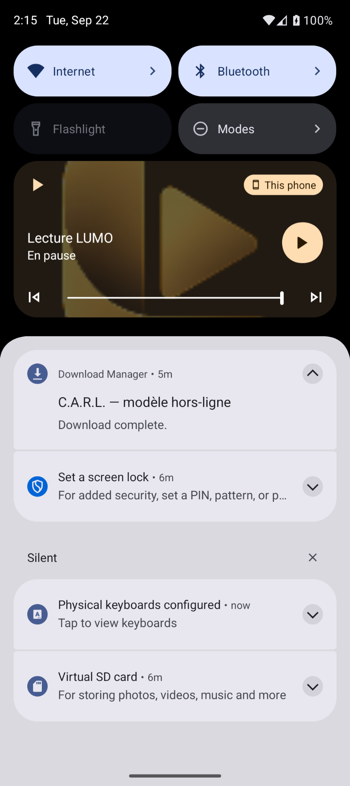
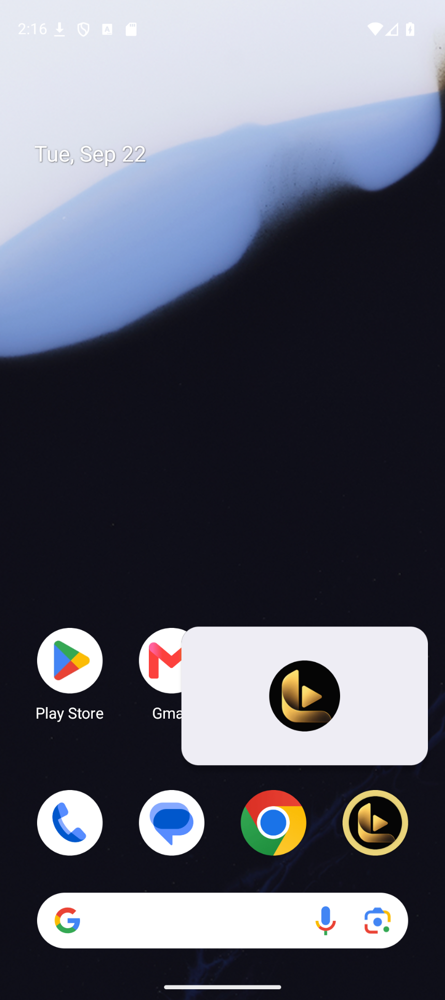

<div align="center">
  

# LUMO for Android

### Le cinéma LUMO / Jellyfin, dans une application Android dédiée.

WebView sécurisée · interface immersive · lecteur Jellyfin · contrôles multimédia Android · Picture-in-Picture

[](https://www.android.com/)
[](https://github.com/0x80070006/LUMO/tags)
[](https://jellyfin.org/)

</div>

> [!WARNING]
> LUMO est un client pour **votre propre** interface LUMO / Jellyfin. Il ne fournit ni serveur, ni compte, ni contenu. Si votre serveur est privé, le téléphone doit pouvoir le joindre — par exemple au moyen de Tailscale.

## Ce que fait l’application

| Fonction | Détail |
| --- | --- |
| Interface LUMO | Ouvre votre interface cinématique directement dans l’application, sans navigateur externe. |
| Première connexion | Propose l’URL du serveur au premier lancement, puis la conserve sur l’appareil. |
| Session Jellyfin | Laisse Jellyfin conserver sa session WebView privée entre les lancements. |
| Lecture robuste | Détecte le lecteur, y compris à travers les iframes Jellyfin, et bascule vers le lecteur natif lorsque l’interface cinématique reste en attente. |
| Écran de chargement | Affiche une transition LUMO lors de l’ouverture de la médiathèque ou d’un lecteur. |
| Notification multimédia | Affiche le titre et la jaquette du média, avec précédent, lecture/pause, suivant et position de lecture. |
| Recherche dans la lecture | Publie une session média Android avec durée et position : le curseur de la notification peut être déplacé sur les systèmes qui exposent ce contrôle. |
| Veille et PiP | Met la vidéo en pause au verrouillage de l’écran et ouvre le Picture-in-Picture au retour à l’accueil pendant une lecture. |
| Plein écran | Masque les barres système ; un balayage depuis le bord les révèle temporairement. |

## Aperçu

<p align="center">
  
</p>

<table>
  <tr>
    <td align="center"><br><sub>Configuration de l’adresse</sub></td>
    <td align="center"><br><sub>Contrôles multimédia Android</sub></td>
    <td align="center"><br><sub>Picture-in-Picture</sub></td>
  </tr>
</table>

## Installer sur un Pixel / GrapheneOS

1. Construisez l’APK depuis les sources comme indiqué ci-dessous, ou récupérez-le depuis une release GitHub lorsqu’une release est publiée.
2. Copiez l’APK sur le téléphone et ouvrez-le. GrapheneOS peut demander d’autoriser l’installation depuis l’application utilisée pour l’ouvrir.
3. Au premier démarrage, contrôlez l’adresse proposée puis touchez **Ouvrir LUMO**.
4. Connectez Tailscale avant de lancer LUMO si le serveur utilise un domaine privé `*.ts.net`.
5. À la première lecture, accordez la permission de notifications : c’est nécessaire pour les commandes multimédia système.

L’adresse et les données WebView restent dans le stockage privé de l’application. Pour repartir de zéro, effacez les données de LUMO dans les paramètres Android.

## Utilisation

```text
Ouverture de LUMO
        ↓
URL déjà mémorisée ?
        ↓
Connexion à l’interface et restauration de session Jellyfin
        ↓
Lecture depuis l’interface cinématique
        ↓
Contrôles Android, notification et Picture-in-Picture
```

### Lecture vidéo

L’interface cinématique LUMO prépare parfois le lecteur Jellyfin dans des iframes. Android WebView peut retarder ce parcours. LUMO surveille donc tous les documents accessibles du lecteur et, si l’ouverture reste bloquée, ouvre la fiche Jellyfin native puis déclenche son action de lecture. Cette solution préserve le lecteur Jellyfin, ses flux et ses choix audio/sous-titres.

### Notification et jaquette

La session média Android est synchronisée avec l’élément vidéo : état, durée, position, titre et sous-titre. La jaquette est demandée à Jellyfin avec le jeton de session de la WebView afin que les illustrations de bibliothèques privées soient affichées correctement. Lors du changement de film, l’ancienne jaquette est retirée avant le chargement de la nouvelle.

La présence exacte du curseur et son apparence dépendent de la version Android et du panneau de notifications de l’appareil. La session expose toutefois bien l’action de recherche (`seek`) à Android.

## Compiler le projet

### Prérequis

- Android Studio récent avec le SDK Android 36 ;
- JDK 11 ou supérieur ;
- un appareil ou émulateur Android 7.0+ (API 24).

```powershell
git clone https://github.com/0x80070006/LUMO.git
cd LUMO
.\gradlew.bat testDebugUnitTest lintDebug assembleDebug
```

L’APK est alors disponible ici :

```text
app\build\outputs\apk\debug\app-debug.apk
```

## Structure du dépôt

```text
app/
  src/main/java/com/example/lumo/
    MainActivity.kt             # Écran de configuration, WebView et PiP
    LumoMediaController.kt      # Pont Jellyfin, MediaSession et notification
  src/main/res/                 # Icône et identité visuelle
gradle/                         # Gradle Wrapper
assets/                         # Logo et captures pour la documentation
```

## Dépannage

| Symptôme | À vérifier |
| --- | --- |
| LUMO ne s’ouvre pas | L’URL, le DNS et la connexion Tailscale. |
| Le serveur demande une connexion | Connectez-vous dans l’écran LUMO ; la session est ensuite mémorisée dans la WebView. |
| Film bloqué sur le chargement | Patientez quelques secondes : la bascule vers Jellyfin natif doit se lancer. Sinon rechargez la page puis relancez le média. |
| Jaquette ou commandes absentes | Autorisez les notifications et vérifiez que la lecture est démarrée. |
| URL incorrecte mémorisée | Utilisez **Changer l’adresse** depuis l’écran d’erreur, ou effacez les données de LUMO. |

## Confidentialité

LUMO ne transmet pas votre bibliothèque vers un service tiers. L’application communique uniquement avec l’adresse configurée par l’utilisateur. Les identifiants, cookies et jetons de Jellyfin restent dans le stockage privé de la WebView Android et servent uniquement à accéder à votre serveur, notamment pour récupérer la jaquette de la lecture en cours.

## Crédits

- [Jellyfin](https://jellyfin.org/) pour le serveur multimédia libre ;
- [Tailscale](https://tailscale.com/) pour l’accès privé au serveur lorsque vous choisissez de l’utiliser.

LUMO n’est pas affilié à Jellyfin ou à Tailscale.
